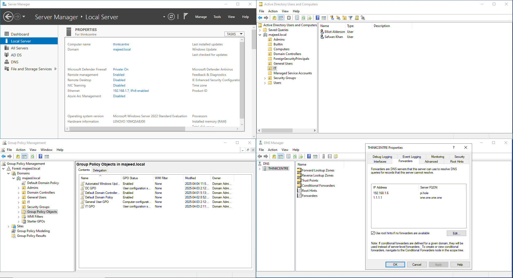
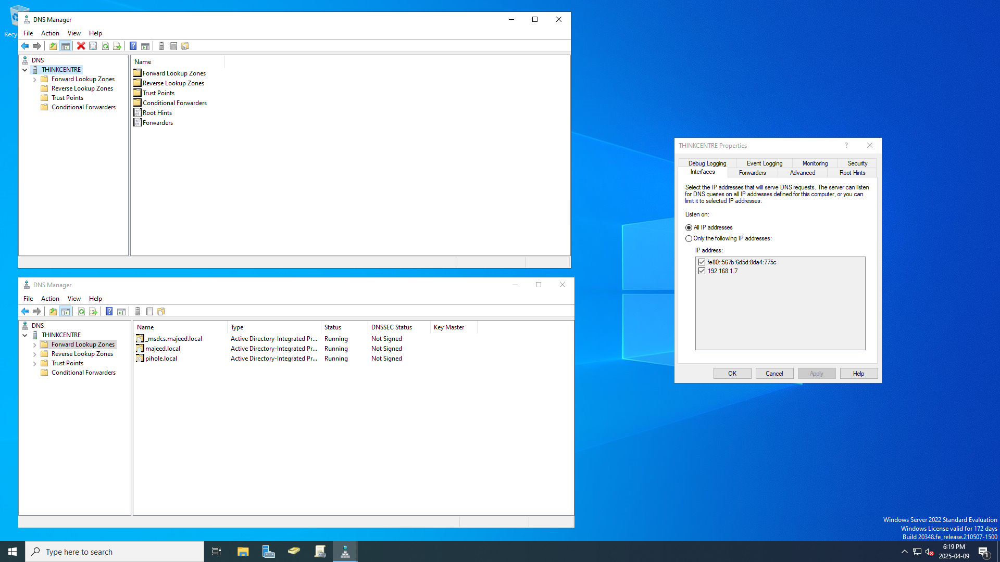
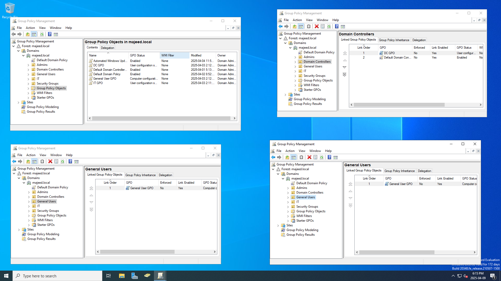
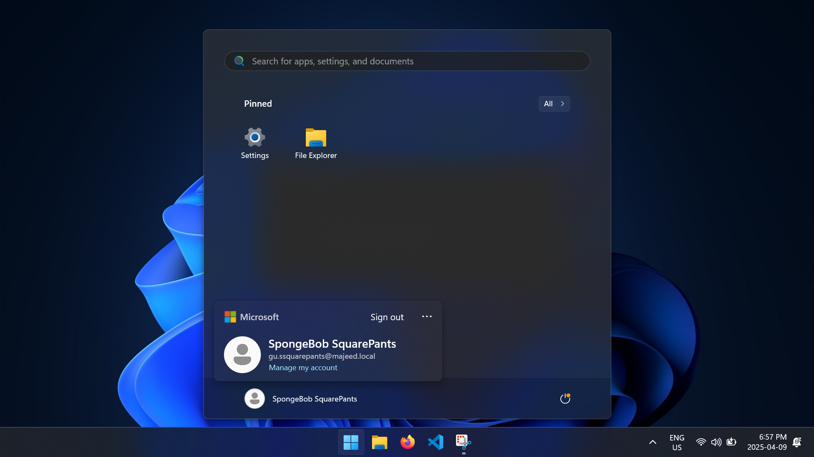

 

Set up a fully functional Active Directory lab on Windows Server 2022 to simulate a real-world enterprise environment for centralized authentication, policy enforcement, and security hardening. Joined multiple devices to the domain and structured Organizational Units (OUs) for granular control. Configured Group Policy Objects (GPOs) to enforce strong password policies, disable LM hash storage, require LDAP and SMB signing, and apply Microsoft's security baselines using the MSCT. Automated workstation debloating with a custom PowerShell script and deployed essential software (Firefox, LibreOffice, VLC, VSCode, Discord, 7-Zip, Python) via Group Policy, creating a secure, efficient, and manageable domain infrastructure.    

# Active Directory Overview
Active Directory (AD) is a directory service developed by Microsoft that enables centralized management of users, devices, applications, and resources within a network. It provides authentication, authorization, and directory services, making it a core component of most enterprise IT infrastructures. AD allows IT administrators to efficiently manage permissions and access control across large-scale environments, supporting scalability and streamlined user management through services like Group Policy and single sign-on (SSO).

AD is widely used in enterprise networks due to its integration with Windows systems and its ability to enforce consistent security policies. However, because it serves as the backbone for access and identity management, securing Active Directory is critical. A compromised AD can give attackers broad control over an entire organization’s infrastructure, making it a prime target. Robust security practices are essential to protect against threats like privilege escalation, lateral movement, and domain compromise.

# Install
To set up my Active Directory home lab, I installed Windows Server 2022 on a Lenovo ThinkCentre and assigned it a static IP address within my local network to ensure consistent communication and DNS resolution. After configuring the network settings, I added the Active Directory Domain Services (AD DS) role and promoted the server to a domain controller, creating a new forest and domain for the lab environment. This setup provided a solid foundation for practicing user and group management, Group Policy configuration, and domain administration in a real-world-like environment.

# Configuration

In my Active Directory lab, I joined both virtual machines and a Lenovo ThinkPad to the domain to simulate a multi-device enterprise environment. This allowed centralized authentication and management, which is critical for enforcing consistent policies across users and devices.

I configured a DNS server on the domain controller to forward all DNS queries to a local Pi-Hole DNS server, allowing for network-wide ad blocking and enhanced threat protection through filtered DNS resolution.

I also created **Organizational Units (OUs)** to logically separate and manage different types of users and computers. This structure made it easier to delegate administrative tasks and apply targeted policies.

To enforce security and configuration standards, I set up **Group Policy Objects (GPOs)** within the OUs. These GPOs controlled settings like password policies, desktop restrictions, and software installation, providing a hands-on understanding of how organizations maintain control and consistency across their network.

# Hardening AD

To harden Active Directory, I used the **Microsoft Security Compliance Toolkit (MSCT)** to apply Microsoft's recommended security baselines and reviewed my Group Policy settings using the **Policy Analyzer**. This helped align my domain controller configuration with industry best practices and identify weak or misconfigured settings early in the process.

I applied the principle of **Least Privilege** by restricting domain admin access to only essential accounts and auditing all users with elevated permissions. I also implemented a **Tiered Access Model (Tier 0, 1, 2)** and **Role-Based Access Control** to better isolate administrative roles and reduce risk from lateral movement.

In terms of **Identity and Access Management (IAM)**, I enforced strong password policies by setting a minimum password length of 12 characters, requiring complexity, and enforcing password history to prevent reuse. I also disabled the storage of **LAN Manager (LM)** hash values to protect against brute-force attacks on weaker password hashes, and enabled **SMB signing** to ensure the integrity of SMB communications and protect against man-in-the-middle attacks.

To further secure directory communications, I required **LDAP signing** on domain controllers to defend against replay and injection attacks targeting unsecured LDAP queries. Additionally, I mitigated common attack vectors like **Kerberoasting** by minimizing privileges for service accounts and securing them with complex passwords, while also removing publicly accessible shares to limit lateral movement opportunities.

# Automation

To streamline client workstation deployment in my Active Directory environment, I used a custom PowerShell script to automate the debloating process across all domain-joined machines. The script targeted either specific machines or entire Organizational Units (OUs), remotely removing unnecessary preinstalled apps, disabling telemetry, Cortana, Xbox features, OneDrive, and other consumer-oriented services. This not only improved system performance but also reduced unnecessary network traffic and enhanced overall security by minimizing the attack surface. 

You can find the script [here!](https://github.com/saqibmaj/AD-winDebloat)

To complement the debloating process, I used Group Policy to deploy a standardized software suite across all workstations, including Firefox, LibreOffice, VLC Media Player, VSCode, Discord, 7-Zip, and Python. Centralizing software installation through GPO helped ensure consistent configurations, saved time during setup, and simplified future maintenance and updates across the domain.

# Challenges
**Group Policy Software Deployment Reliability**  
One challenge I encountered was ensuring consistent software deployment via Group Policy across all domain-joined machines. Some systems intermittently failed to install applications like LibreOffice or VSCode due to delayed Group Policy refresh cycles or user permissions blocking MSI execution during startup. This inconsistency created gaps in the workstation environment and added overhead to manually verify each installation.

To overcome this, I configured the GPO to install software at startup (rather than login), ensured the MSI packages were hosted on a reliable, accessible network share with the correct NTFS and share permissions, and used gpresult and event logs to troubleshoot failures. I also enabled verbose logging for the Group Policy client to identify machines that required additional attention, which ultimately led to a smoother, more predictable deployment process.

**Remote Debloating Script Execution Permissions**  
Another hurdle involved remotely executing the debloating PowerShell script on domain-joined workstations, particularly when dealing with default Windows firewall settings and constrained PowerShell remoting policies. Initial attempts were blocked due to disabled WinRM services or insufficient admin rights on the target machines.

To address this, I created a startup script that enabled and configured WinRM via GPO, allowing secure remote sessions. I also scoped permissions carefully, ensuring only authorized admin accounts could execute debloat operations. By automating script execution through Organizational Units and leveraging the -WhatIf flag during testing, I safely rolled out changes and verified behavior before applying them across the domain.

# Conclusion
In conclusion, building and hardening an Active Directory lab environment provided hands-on experience with enterprise-grade identity management, policy enforcement, and automation. By installing and configuring Windows Server 2022 as a domain controller, structuring OUs, and applying GPOs for security and software deployment, I created a scalable and secure foundation for centralized administration. Through debloating workstations with a custom PowerShell script and deploying essential software via Group Policy, I streamlined client setup while reducing attack surface and improving performance. Despite challenges with software deployment reliability and remote execution permissions, careful troubleshooting and automation ensured a successful and resilient implementation—equipping me with practical skills applicable to real-world enterprise IT environments.
