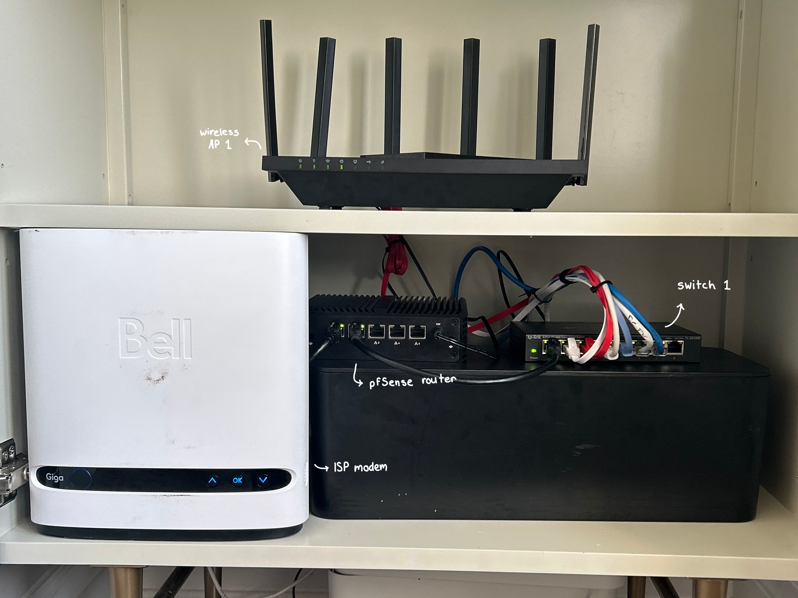
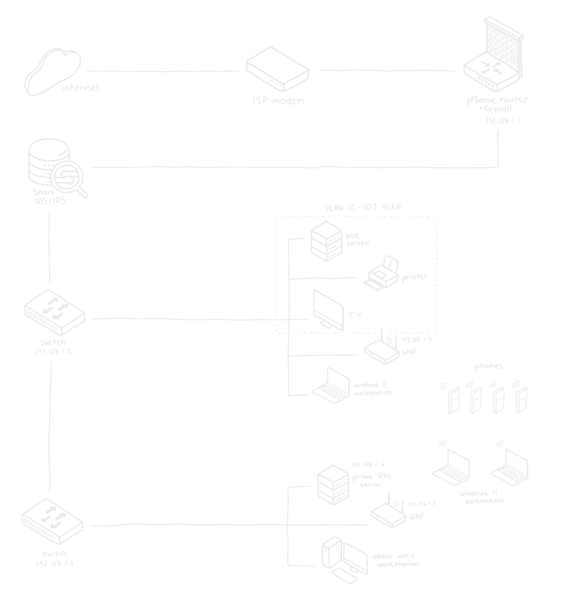
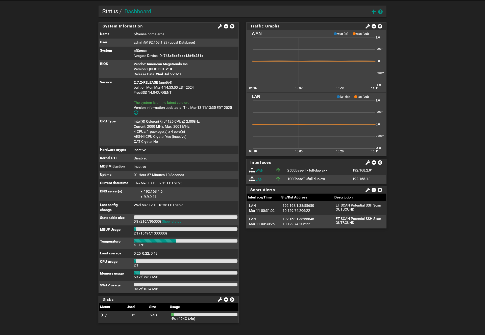
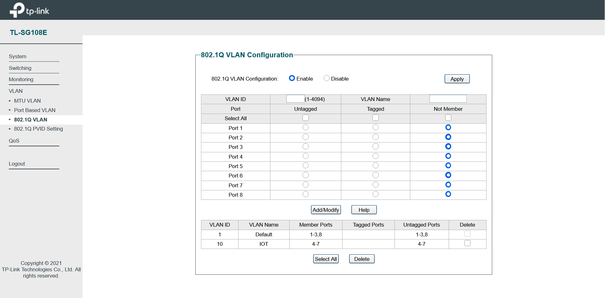

Design a secure, performant, and scalable home network that simulates a small-scale enterprise network using robust open-source technologies. Ensure compliancy with fundamental security frameworks to secure against threat vectors. Continuously optimize the network to ensure high-availability, security, and scale-up to meet growing needs.      

# Network Overview

### Topology

The network uses a **star topology** where all devices connect to a central router. This configuration was chosen for its simplicity, scalability, and ease of administration. In this topology:

**pfSense Router**
    - Acts as the core router, firewall, and VPN gateway.
**Managed Switches**
    - Two interlinked switches extend the wired connectivity of the network, thereby increasing performance, and security. 
**Wireless Access Points**
    - The wireless network is extended by using routers that are configured as wireless APs, in a mesh network configuration that ensures high-speed coverage across the house.

### IP Addressing Scheme
A hybrid IP addressing scheme is implemented, with:

- **Static IPs** for critical infrastructure like the router, switches, and key network servers.
- **Dynamic IPs (DHCP)** for less critical devices like personal computers, IoT devices, and other peripherals, offering flexibility and ease of management.    

# Network Infrastructure

### pfSense

Incorporated pfSense because it offers a high level of control and security. As an open-source firewall and router solution, it provides advanced features like VPN support, traffic management, and comprehensive network monitoring. Being free and highly customizable, pfSense allows me to optimize my network's performance and security in ways that the default router software couldn’t. It’s been an invaluable tool for enhancing both the protection and efficiency of my network.

### IoT VLAN

Placed Internet of Things (IoT) devices in a segmented Virtual Local Area Network (VLAN) enhances security by isolating them from the main network, reducing the attack surface. This containment limits the potential impact of a compromised IoT device, preventing lateral movement to critical systems. It also allows for more granular control over traffic, enabling stricter access controls and monitoring for suspicious activity.    

# Challenges

### ISP Modem
During setup, the ISP modem could not be configured in bridge mode, causing a double NAT issue with the pfSense router. This prevented public facing services such as the CCTV cameras from functioning properly, or being accessed through their mobile app. 

To resolve this, an advanced DMZ configuration was set up on the pfSense router through the modem's web-based interface. This allowed the pfSense router to bypass the double NAT issue by making the router a public facing device, and therefore issuing the WAN interface with my network's public IP address. This ensured that the pfSense router managed all routing and traffic without interference from the ISP modem’s NAT, restoring functionality to the CCTV cameras.

### Interlinked Switches

Configuring the interlinked managed switches posed a challenge, mainly with preventing network loops. Without proper configuration, the switches could create loops, leading to network instability. The key solution was enabling Spanning Tree Protocol (STP) to prevent redundant paths from forming.

Additionally, the switch port connecting to the secondary switch was configured as a trunk port, allowing multiple VLANs to pass between the switches without issues. Once STP was properly configured and the trunk port set up, redundant links were blocked, eliminating loops and ensuring stable, efficient communication across the network.    

# Security Principles

### Secure by Design
Security is integrated from the start by using pfSense as the core router and firewall, providing built-in traffic filtering, logging, and VPN services. The network's segmentation into VLANs (like isolating IoT devices) ensures that security considerations are baked into the design from the ground up, reducing vulnerabilities.

### Separation of Duties
The network is structured with different roles assigned to specific devices, such as the pfSense router/firewall handling traffic filtering and VPN services, while managed switches ensure network performance and segmentation. Each network component is responsible for a specific function, minimizing the risk of a single point of failure or compromise.

### Defense in Depth
Multiple layers of security are employed throughout the network. pfSense provides firewall protection and VPN capabilities, mesh Wi-Fi access points offer seamless but secure wireless connectivity, and the use of VLANs for IoT devices adds an additional layer of isolation. These layered defenses ensure that even if one part of the network is compromised, other protections remain intact.    

# Conclusion

The home network design successfully created a secure, scalable, and high-performance environment using a star topology, with pfSense as the core router and firewall. Key security measures, including network segmentation with VLANs and a defense-in-depth strategy, ensure robust protection against threats. Challenges like ISP modem configuration and switch management were addressed with solutions such as advanced DMZ setup and STP, ensuring network stability and performance. Overall, the project demonstrates the effectiveness of integrating security from the start while leveraging open-source technologies for a future-proof network.