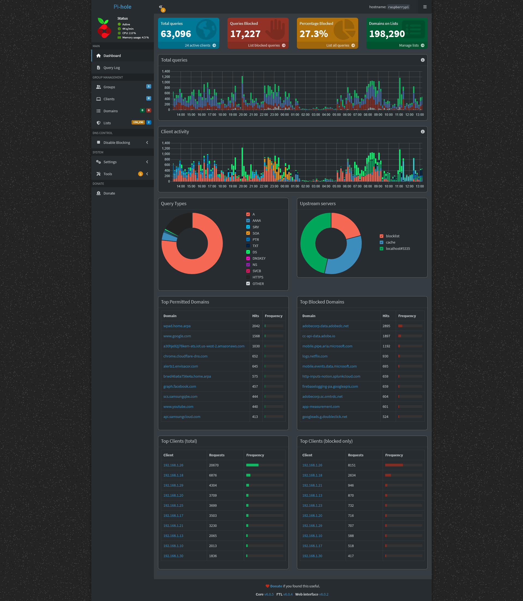

Deploy a recursive Pi-Hole DNS sinkhole on a Raspberry Pi to improve network security by blocking unwanted ads, tracking domains, and malicious websites. Configure Pi-Hole to filter DNS requests at the network level, preventing devices from accessing harmful or undesirable content. Regularly update blocklists and fine-tune settings to optimize performance, reduce security vulnerabilities, and ensure the protection of all connected devices from potential threats.    

# Pi-Hole Overview

Pi-Hole acts as a middleman between devices and the internet, filtering DNS requests and blocking access to unwanted content, such as ads, tracking scripts, and potentially harmful websites. By integrating Pi-Hole, the network is protected from domains known for phishing, malware, and other online threats, effectively reducing the risk of compromise. The implementation enhances privacy by preventing third-party tracking, while also optimizing network performance by reducing unnecessary content and resource usage. 

# Install 
Flashed Raspberry Pi OS onto a Raspberry Pi, and then SSH'd into the Pi to intall Pi-Hole using an installation script, which simplifies the process by handling dependencies and configuration. Set a static IPv4 address to ensures that it consistently maintains the same address on the network, preventing any disruptions in DNS resolution. 

# Blocklists
To configure Pi-Hole blocklists effectively, I carefully selected a curated set of blocklists that specifically target malicious domains, ads, and trackers. I avoided redundancy by choosing lists with minimal overlap, ensuring each list served a distinct purpose, such as blocking malware or privacy trackers. I also prioritized high-quality, regularly updated lists to reduce network overhead and improve efficiency. By enabling only the most relevant blocklists and regularly reviewing and updating them, I minimized unnecessary DNS queries and kept the system running smoothly.

# Unbound DNS
Unbound is a recursive DNS resolver that enhances security by directly resolving DNS queries without relying on third-party DNS servers. It helps prevent DNS spoofing and man-in-the-middle attacks by encrypting DNS queries with DNSSEC (Domain Name System Security Extensions) and ensuring query integrity. 

In Pi-Hole, I configured Unbound as the upstream DNS resolver to provide an additional layer of security, allowing Pi-Hole to handle DNS requests locally and resolve them recursively. This setup reduces reliance on external DNS providers, improves privacy, and ensures faster, more secure DNS resolution within the home network.

# Challenges

### pfSense Setup
Configuring pfSense to redirect DNS queries to Unbound presented a challenge because pfSense's default DNS resolver settings typically use external DNS servers. I needed to adjust the system to route DNS requests through Unbound running on the Pi-Hole, which required modifying the DNS settings in pfSense.  

To resolve this, I configured pfSense to use the Raspberry Pi’s IP address (where Pi-Hole and Unbound were set up) as the primary DNS server, while ensuring that DNS forwarding and firewall rules were correctly set to allow proper communication between pfSense and the Pi-Hole server. This setup enabled Pi-Hole to filter and Unbound to resolve DNS queries securely.

### Increased Overhead 
One of the main challenges of using stricter blocklists in Pi-Hole is managing redundancy and the increased network overhead. Stricter blocklists, often with a broader scope, can lead to multiple lists blocking the same domains, which results in redundant entries and unnecessary DNS queries. This redundancy not only wastes resources but can also slow down DNS resolution, increasing network latency.

To resolve this, I focused on finding a balance between security and performance by carefully selecting high-quality, curated blocklists that target specific threats—such as malware, trackers, and ads—while minimizing overlap. I ensured that the lists were updated regularly to stay current with emerging threats, but avoided overloading Pi-Hole with excessive or redundant lists.    

# Conclusion
In conclusion, deploying a recursive Pi-Hole DNS sinkhole on a Raspberry Pi significantly improved network security by blocking unwanted ads, trackers, and malicious websites. By carefully configuring Pi-Hole with targeted, high-quality blocklists and integrating Unbound as a local DNS resolver, I was able to enhance privacy and prevent potential online threats. Despite challenges with pfSense configuration and managing network overhead from stricter blocklists, these were effectively addressed to ensure optimal performance and reliability. This setup not only strengthened the security of all connected devices but also streamlined the network's DNS resolution, providing a safer and more efficient browsing experience.
