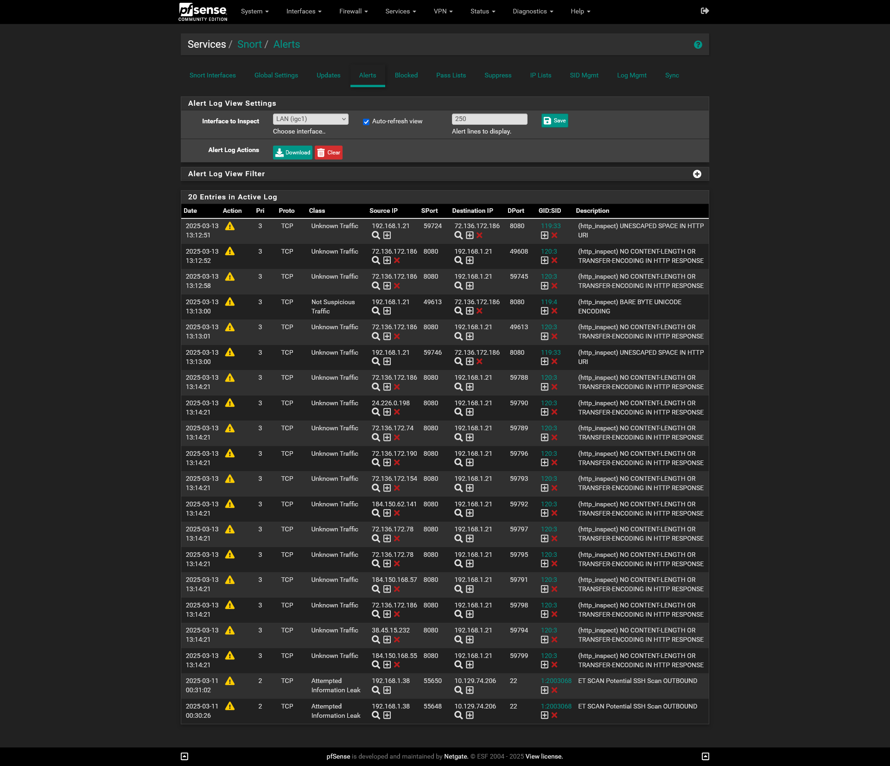

Implement a Snort IDS/IPS solution within a home network using pfSense to enhance security and monitor network traffic for potential threats. Configure and fine-tune Snort for optimal performance and accuracy, ensuring real-time detection and prevention of malicious activity. Maintain ongoing updates and adjustments to keep the system effective against evolving security risks while minimizing false positives.   

# Snort Overview

Snort is an open-source IDS/IPS that analyzes network traffic in real-time to detect and prevent malicious activity. It logs potential threats, allowing for proactive responses, and can actively block harmful traffic. Snort protects against a range of attacks, including malware and unauthorized access, reducing the risk of data breaches and enhancing network security.    

# Install 
Installed Snort through pfSense's Package Manager and configured it to run real-time detection and prevention on the LAN interface.    

Configuring Snort on the LAN interface helps detect internal threats like malware or unauthorized access. On a WAN interface, Snort would generate more false positives due to the high volume of benign external traffic, such as scans or bots. This increases alerts and network overhead, reducing performance and efficiency.    

# Configuring Rules
I’ve configured Snort with the following rules:

   - **Network-based signature rules**:  
  Focused on high-risk services like HTTP and SMB, targeting known attack patterns while minimizing overhead.
- **Anomaly-based rules**:  
  Detect unusual traffic patterns (e.g., traffic spikes) to identify potential attacks without generating false positives.
- **ICMP and port scan detection**:  
  Block common threats like DDoS and scanning attempts.
- **Application layer rules**:  
  Monitor web protocols (HTTP, DNS) for attacks like SQL injection and XSS.
- **Logging and alerting thresholds**:  
  Set to log suspicious events and generate alerts, ensuring precise detection without overwhelming the system.

    

# Challenges

