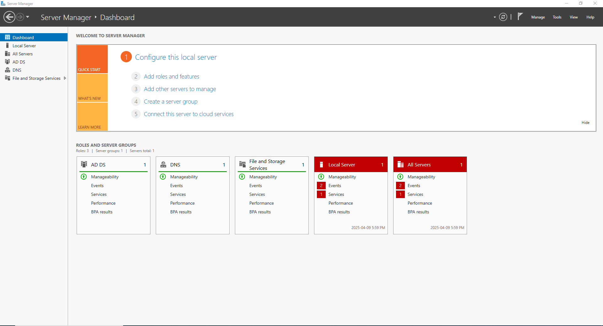

Active Directory (AD) is the backbone of centralized management in most enterprise environments. Its deep integration with Windows systems and administrative control over users, devices, and permissions make it both indispensable and highly vulnerable. When AD is compromised, the consequences can be catastrophic—attackers can gain the keys to the kingdom, moving laterally, escalating privileges, and ultimately taking over entire domains. As such, hardening Active Directory isn't just a best practice—it's a critical defense strategy. This article outlines proven security measures to fortify your AD environment against common attack vectors and advanced persistent threats.

### Key Takeaways
**Active Directory Is a Prime Target:** As the central hub for identity and access management in enterprise environments, a compromised Active Directory (AD) can lead to full domain control. Hardening AD is essential to prevent lateral movement and privilege escalation.

* **Least Privilege Minimizes Damage:** Following the Principle of Least Privilege ensures users and systems only have access to what they truly need. Use role-based access, separate admin accounts by tier, and regularly audit accounts to avoid privilege creep.

* **Implement a Tiered Access Model (TAM):** Divide your AD environment into tiers to contain compromise:
    - Tier 0: Domain Controllers, Enterprise Admins (most sensitive)
    - Tier 1: Servers and application admins
    - Tier 2: End-user devices and standard user accounts

* **Secure IAM Practices in Active Directory:** Identity and Access Management (IAM) should include strong authentication and control mechanisms:
    - Disable LM hash storage to prevent weak, brute-forceable password hashes
    - Enable SMB signing to defend against Man-in-the-Middle (MiTM) attacks
    - Require LDAP signing to block injection and replay attacks

* **Enforce Password Hygiene and Rotation:** Strong, frequently rotated passwords limit the risk of credential compromise:
    - Use PowerShell scripts or gMSAs for automation
    - Enforce password length (10–14 characters), complexity, and history
    - Implement MFA to reduce reliance on passwords alone

* **Kerberoasting Is a Silent Credential Theft Technique:** Attackers can request Kerberos tickets for service accounts, then brute-force them offline:
    - Use long, complex passwords for service accounts
    - Rotate service account credentials using gMSAs
    - Enable MFA on privileged accounts
    - Audit for unnecessary Service Principal Names (SPNs)
    - Monitor for Kerberoasting tools and abnormal TGS traffic

* **Ongoing Monitoring Is Critical:** Regularly review logs, detect abnormal behavior, and investigate privilege changes. Security in Active Directory is not a one-time fix—it’s a continuous process.

### Least Privilege
The **Principle of Least Privilege** means giving users, systems, and applications *only* the access they need—no more, no less. In Active Directory (AD), enforcing this principle limits the blast radius of any compromise, helps prevent privilege escalation, and strengthens overall network security.

**1. Set Up the Right Types of Accounts**

Start by organizing account types based on their purpose and privilege level:

- **User accounts**
  - Use for everyday tasks (email, documents, apps).
  - Should not have admin rights or access to sensitive systems.

- **Privileged accounts**
  - Create **separate** accounts for admin tasks.
  - Further split into:
    - **Tier 0** admins (Domain Admins, Enterprise Admins).
    - **Tier 1** admins (server/application admins).
    - Never use these accounts to browse the internet or check email.

- **Shared accounts**
  - Avoid when possible.
  - If required (e.g., for temporary vendor access):
    - Assign only minimum necessary privileges.
    - Monitor closely.
    - Disable or remove after use.

**2. Use Role-Based Access Control (RBAC)**

Implement access permissions based on user roles, not individual accounts:

- Define job roles (e.g., Help Desk, HR, Server Admin).
- Use **Security Groups** in AD to assign permissions by role.
- Apply granular access to AD objects and resources:
  - DNS zones
  - Organizational Units (OUs)
  - File shares
  - GPOs

✔️ *Example: Only DNS Admins can edit DNS records—others can read only.*

**3. Implement the Tiered Access Model (TAM)**

TAM helps isolate administrative roles and systems to prevent privilege escalation. Break your AD infrastructure into three tiers:

- **Tier 0** – Most sensitive
  - Domain Controllers
  - AD schema and configuration
  - Enterprise and Domain Admin accounts

- **Tier 1** – High-value but less sensitive than Tier 0
  - Member servers (e.g., SQL, Exchange)
  - Application admins
  - Server management accounts

- **Tier 2** – Least sensitive
  - Workstations and user devices
  - HR, Sales, Finance staff accounts

✅ **Action Steps:**
- Never log into Tier 0 systems with Tier 1 or Tier 2 accounts.
- Enforce boundaries with **Group Policy Objects (GPOs)** to deny lateral movement.
- Create **separate admin workstations** (PAWs) for Tier 0 tasks.

**4. Audit Accounts Regularly**

Ongoing monitoring ensures Least Privilege stays intact:

- **Usage audits**
  - Review login patterns.
  - Detect unused or rarely used accounts.

- **Privilege audits**
  - Confirm accounts only have the rights they need.
  - Look for "privilege creep" (e.g., users accumulating rights over time).

- **Change audits**
  - Monitor changes to:
    - Group memberships
    - GPOs
    - User rights assignments
    - Password policies

### Identity and Access Management (IAM)
Identity and Access Management (IAM) refers to the framework of policies and technologies that ensure the right individuals access the right resources at the right times—for the right reasons. In cybersecurity, IAM is critical for preventing unauthorized access, protecting sensitive data, and enforcing accountability across IT environments.

In Active Directory, secure IAM practices revolve around strengthening user authentication, enforcing access control, and minimizing identity-based threats like credential theft and replay attacks.

**1. Disable LAN Manager (LM) Hash Storage**

LM hashes are outdated and vulnerable to brute-force attacks. Prevent Windows from storing them:

- Go to:  
  `Group Policy Management Editor > Computer Configuration > Policies > Windows Settings > Security Settings > Local Policies > Security Options`
- Edit:  
  `Network security: Do not store LAN Manager hash value on next password change`
- ✅ **Set to:** `Enabled`

**2. Enable SMB Signing**

SMB signing protects file and print communication from Man-in-the-Middle (MiTM) attacks by ensuring message integrity.

- Go to:  
  `Group Policy Management Editor > Computer Configuration > Policies > Windows Settings > Security Settings > Local Policies > Security Options`
- Edit:  
  `Microsoft network server: Digitally sign communications (always)`
- ✅ **Set to:** `Enabled`

**3. Require LDAP Signing**

LDAP is used for authentication and directory lookups. Enforcing signing helps prevent replay and injection attacks.

- Go to:  
  `Group Policy Management Editor > Computer Configuration > Policies > Windows Settings > Security Settings > Local Policies > Security Options`
- Edit:  
  `Domain controller: LDAP server signing requirements`
- ✅ **Set to:** `Require signing`

**4. Implement Password Rotation**

Frequent password changes help reduce the risk of credential theft. You can choose from several approaches:

- **Option 1: PowerShell Script**
  - Automate password changes using a scheduled PowerShell script.
  - ✅ Pro: No extra tools needed  
  - ❌ Con: Requires custom scripting & maintenance

- **Option 2: Use MFA Instead of Frequent Changes**
  - Add a Multi-Factor Authentication solution to AD.
  - ✅ Pro: Adds stronger security  
  - ❌ Con: Still requires proper password hygiene

- **Option 3: Use Group Managed Service Accounts (gMSAs)**
  - Automatically rotate service account passwords every 30 days.
  - ✅ Pro: Low maintenance, secure  
  - ❌ Con: Only for services, not user accounts

**5. Enforce Strong Password Policies**

Set password rules to prevent weak or guessable credentials:

- Go to:  
  `Group Policy Management Editor > Computer Configuration > Policies > Windows Settings > Security Settings > Account Policies > Password Policy`
  
**Configure the following:**

- 🔁 **Enforce password history:** Prevent reuse of at least 10–15 previous passwords  
- 🔑 **Minimum password length:** Set to **10–14 characters**  
- 🧠 **Complexity requirements:** Require:
  - Uppercase letters
  - Lowercase letters
  - Numbers or symbols
  - No part of the username in the password

### Kerberoasting
Kerberoasting is a post-exploitation attack technique used to steal credentials in Active Directory environments. It targets service accounts that use Kerberos authentication with a registered Service Principal Name (SPN).

How it works:
- The attacker scans for user accounts with SPNs.
- They request Kerberos Service Tickets (TGS) for these accounts.
- The ticket is encrypted with the service account’s password hash.
- The attacker extracts the ticket (using tools like Mimikatz or Invoke-Kerberoast.ps1).
- They brute-force the password offline, avoiding detection by standard monitoring tools.

Once the password is cracked, the attacker can gain access to privileged services and move laterally across the network—often without triggering any alerts. To reduce your risk, apply these best practices:

***🔐 1. Use Long, Complex Passwords for Service Accounts***
- Service account passwords should be long, complex, and manually rotated regularly.
- Avoid using easily guessable or default passwords.

**🔁 2. Rotate Service Account Passwords Frequently**
- Use Group Managed Service Accounts (gMSAs) to automatically rotate service account passwords every 30 days.
- This limits the window of opportunity for brute-force cracking.

**🧱 3. Enable Multi-Factor Authentication (MFA)**
- Add MFA to service and privileged accounts whenever possible.
- Even if a password is compromised, MFA adds another layer of defense.

**🔎 4. Audit for Accounts with SPNs**
- Regularly scan your AD for user accounts with SPNs.
- Verify which accounts really need SPNs and remove them from unnecessary accounts.
- 🔧 Use PowerShell:
    Get-ADUser -Filter {ServicePrincipalName -like "*"} -Properties ServicePrincipalName

**⚠️ 5. Monitor for Kerberoasting Activity**
- Detect use of common attack tools (like PowerSploit, PowerShell Empire, or Invoke-Kerberoast).
- Monitor for unusual TGS requests or large volumes of ticket activity.

### The Bottom Line
The security of Active Directory is central to the resilience of any modern enterprise network. As the primary system for managing user identities, permissions, and access, AD is a high-value target for attackers—and when compromised, it grants near-total control over the IT environment. From enforcing the Principle of Least Privilege to deploying secure Identity and Access Management (IAM) practices and defending against stealthy threats like Kerberoasting, organizations must adopt a layered, proactive defense strategy. Securing AD is not just about protecting accounts—it’s about safeguarding the entire digital infrastructure. By hardening AD, monitoring continuously, and staying ahead of evolving threats, organizations can protect their most critical assets and ensure the stability, integrity, and trustworthiness of their networks. Ultimately, strong AD security is the cornerstone of enterprise security.
